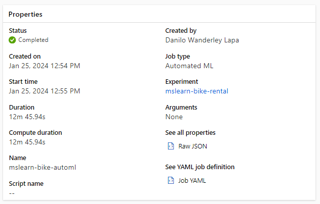
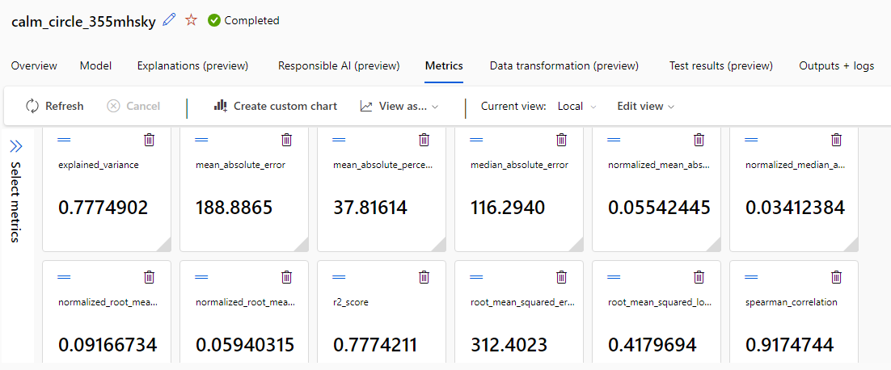
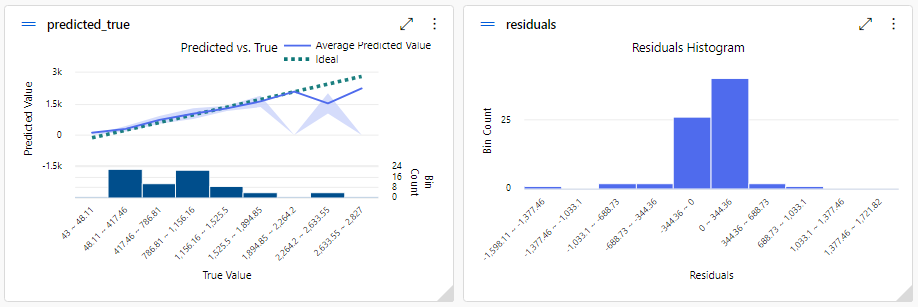

# Automated Machine Learning in Azure Machine Learning

Este repositório foi feito para mostrar o meu primeiro contato com a ferramente de Machine Learning da Azure, no qual foi ensinado no bootcamp da DIO seguindo o [tutorial](https://microsoftlearning.github.io/mslearn-ai-fundamentals/Instructions/Labs/01-machine-learning.html) do site da Azure Machine Learning a utilizar uma das ferramentas de IA que a Azure oferta que é o Automated Machine Learning permitindo que seja experimentado vários algoritmos e parâmetros para treinar vários modelos e identificar o melhor para seus dados. O tutorial consiste em criar um modelo de regressão para prever a quantidade de bicicletas alugadas no mês usando um [dataset público](https://aka.ms/bike-rentals).

## Modelos
- RandomForest
-  LightGBM

## Resumo do Modelo

## Métricas do Modelo

## Análise do Modelo

## Requisitos
- Criar uma conta free no Microsoft Azure
